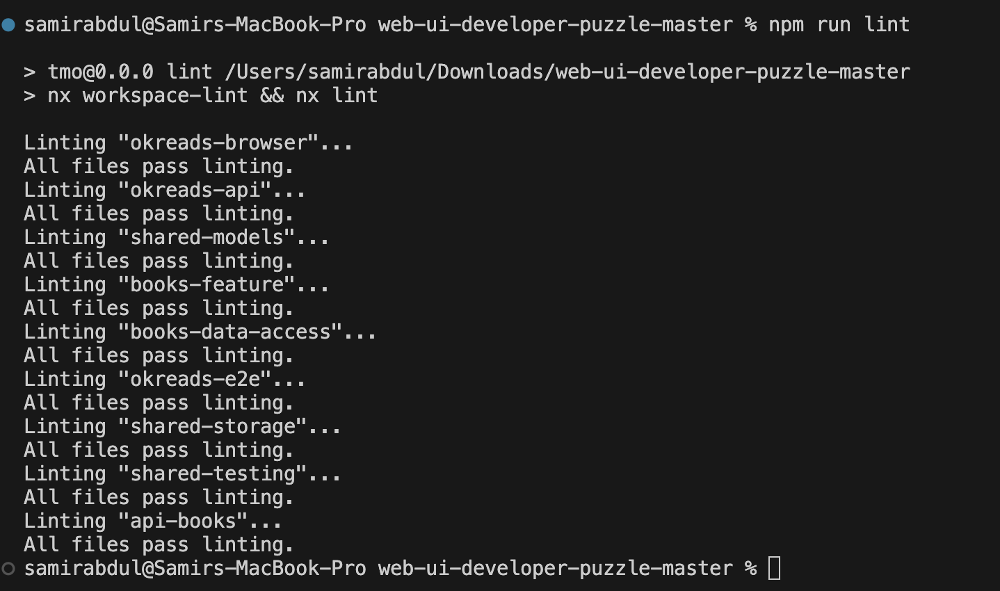
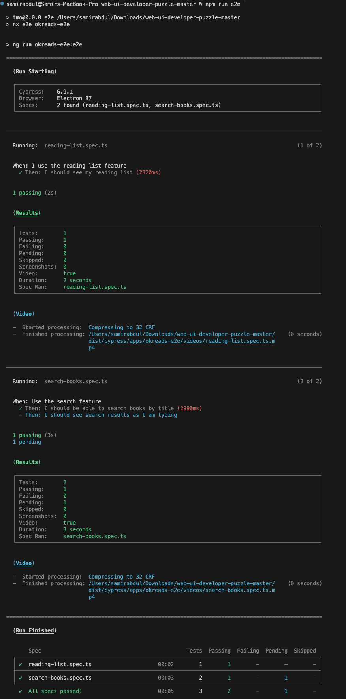
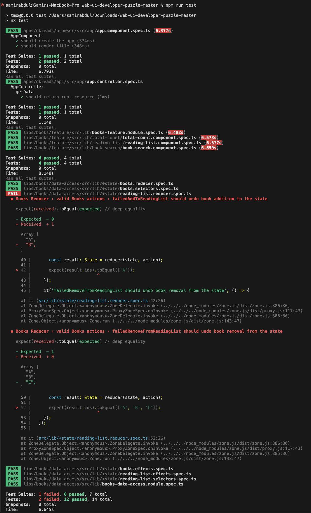
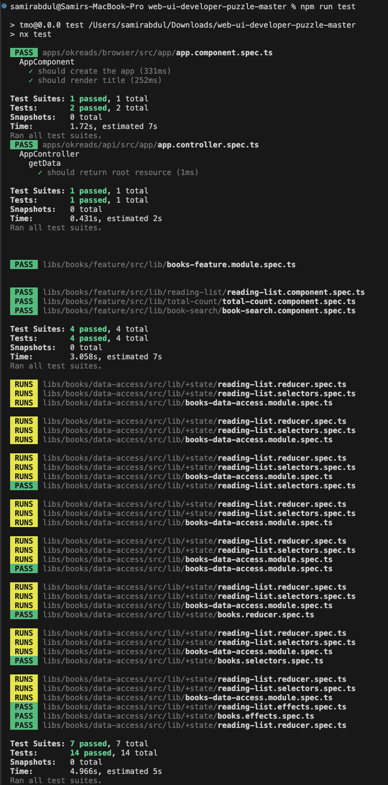
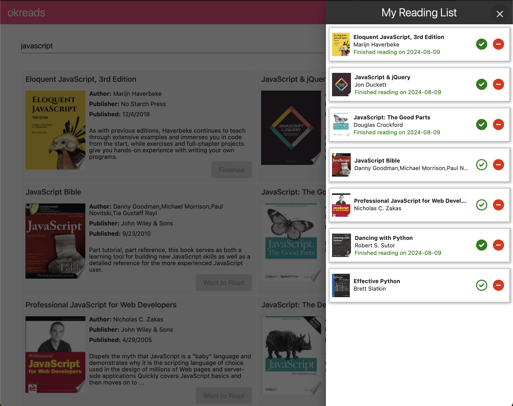
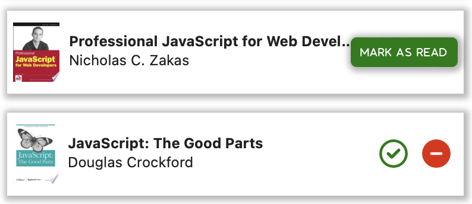
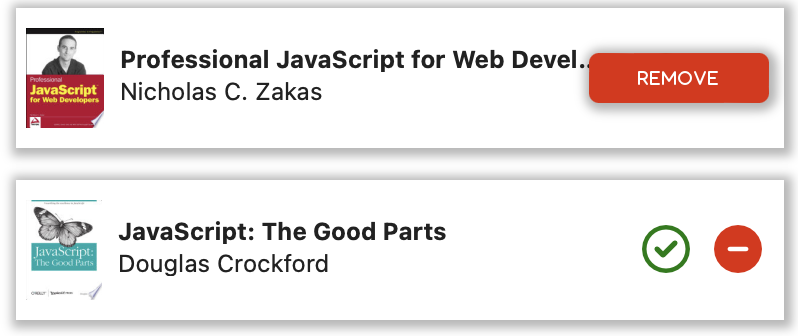
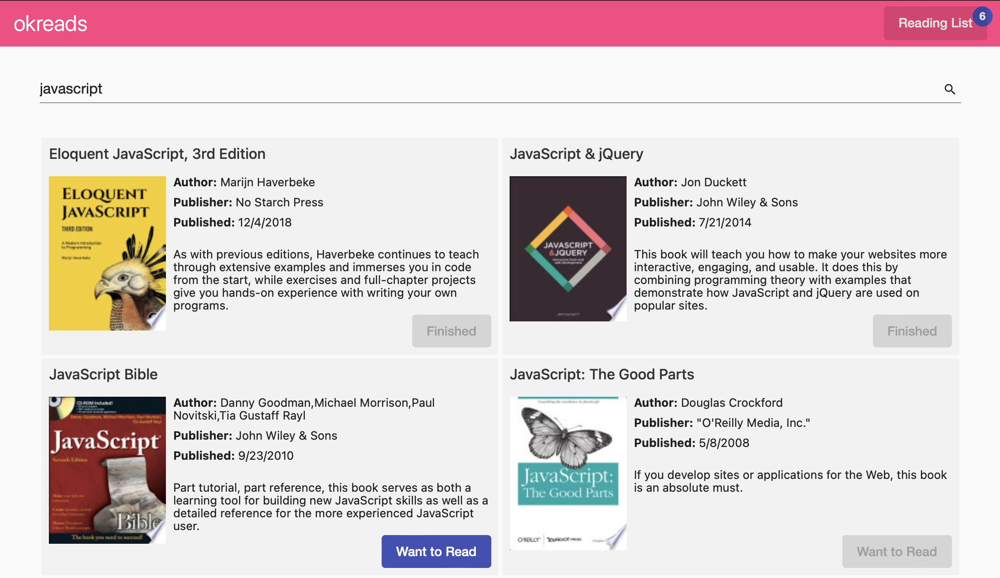

# Code Review 

## Task 1:

  ## List of Code smells in the Code are
  * Return type of many functions is not declared in the code. declaring the return type helps in echancing type safety, code readability and accidental assignation. 
        examples: searchBooks(), formatDate()...
  * 
    
  ## Accessibility Issues
  1. LightHouse Detected:
     * Buttons do not have an accessible name.
       1. In [book-search.component.html](./libs/books/feature/src/lib/book-search/book-search.component.html), line 10
         `<button mat-icon-button matSuffix aria-label="search">`.
       
       2. In [app.component.html](./apps/okreads/browser/src/app/app.component.html), line 26
            `<button mat-icon-button (click)="drawer.close()" aria-label="close">`
            similarly to other buttons too.

     * Background and foreground colors do not have a sufficient contrast ratio.
            - Change the color of the font to much darker color.
            [book-search.component.scss](./libs/books/feature/src/lib/book-search/book-search.component.scss), at line 71 change `color: $gray40;` to `color: $gray85;`.
    
  2. Manually Detected:
      * alt attribute is missing in img tag.
            In book-search.component.html, add alt attribute to the ``. 
            update to ``

        * Form labels are missing.
            In book-search.component.html, add the labels to the search input field.
            `HTML<mat-label>Search</mat-label>`
        * Javascript Anchor tag, reading list toggle button is not accessible. 
            Add the href attribute to anchor tag, aria-label and tabindex to anchor tag and toggle button.

## Testing
* Lint Testing - All testcases passed.
  
  
  
* E2E Testing - All testcases passed.
  
  
  
* Unit Testing - 12/14 testcases passed, 2 failures.
  
  
  
* Unit Test Cases fixed - 14/14 testcases passed.
  
  

## Task 4
  ## Functionality to Mark the Book in Reading List as Read is added.

  When User mark the book as read, The date of completion will be displayed to the user. 

  Hover Effect for `mark as read` and `remove` buttons are added.

  The UI design of the list is as follows.
  

  Hover Effect 
  
  
  
  In the catalog of Books, The `Want to Read` button of finished book should be changed to `Finished` and the Finish status should be reset if the finished book is removed from the Reading list.

  Dynamc Buttons based on the finish status
  

  ## Testing 
  These are the scenerios that were tested 

  1. When: I mark the book as Read.
  * Then: Display the finishedDate
  * Then: The Button in Books catalogue should be updated as `Finished`.

  2. When: I remove the book from reading list.
  * Then: Update the Button in Books catalogue from `Finished` to `Want to Read`
  * Then: If we add the same book to the reading list again the finishedDate is reset.

  