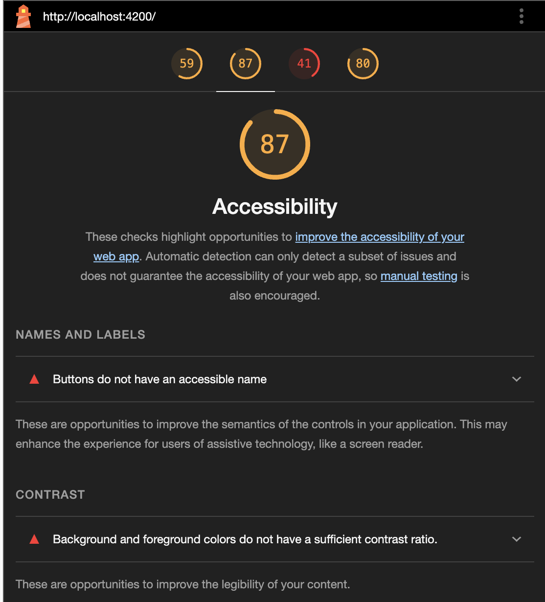
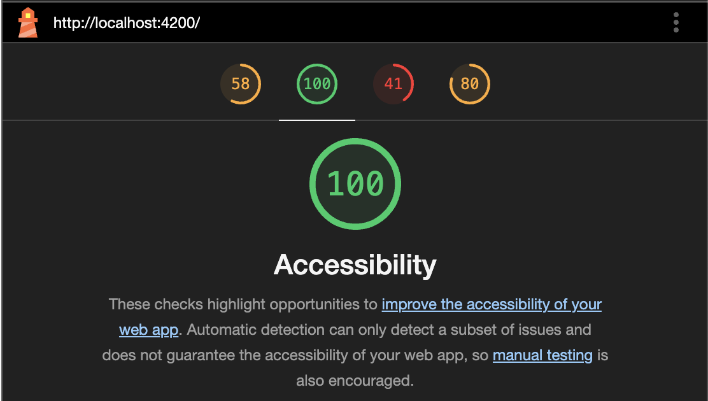
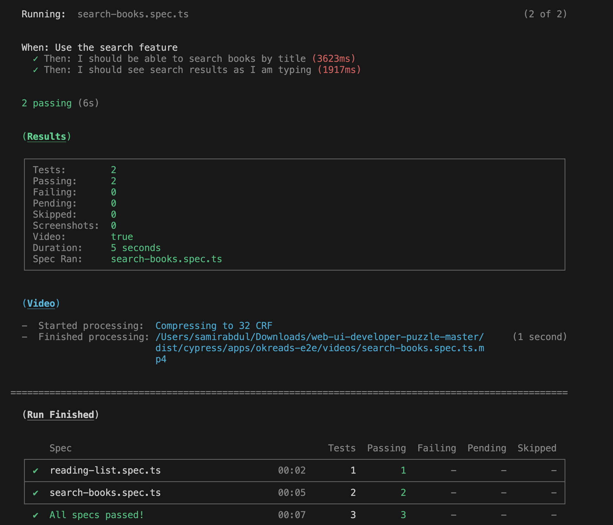

# Code Review 

## Task 1: Code Review and Fix

  ## List of Code smells in the Code are
  * Return type of many functions is not declared in the code. Declaring the return type helps in echancing type safety, code readability and accidental assignation. 
        examples: searchBooks(), formatDate()...
  * In Controller classes, instead of writing the entire URL path in every request we can declare an Base URL and handle the relative URLs.
  * Use of Magic strings in `reading-list.effects.ts` class,

> Magic strings are string literals that are used in code without being assigned to a named constant or variable. They are often used as keys, identifiers, or values in code, but their meaning is not immediately clear from the code itself.

  ## Suggested Improvements in the Application
  * The UI of the Books Catalogue can be improved.
  * Filtering functionality can be added based on Genre, Author, Publisher.
  * sorting functionality can be added based on the Latest, Most Read, Editor's Pick.
  
    
## Accessibility Issues
  1. LightHouse Detected:
     * Buttons do not have an accessible name.
       1. In [book-search.component.html](./libs/books/feature/src/lib/book-search/book-search.component.html), line 10
          
          `<button mat-icon-button matSuffix aria-label="search">`.
       
       2. In [app.component.html](./apps/okreads/browser/src/app/app.component.html), line 26
            `<button mat-icon-button (click)="drawer.close()" aria-label="close">`
            similarly to other buttons too.

     * Background and foreground colors do not have a sufficient contrast ratio.
       1. Change the color of the font to much darker color.
          In [book-search.component.scss](./libs/books/feature/src/lib/book-search/book-search.component.scss), at line 71 change `color: $gray40;` to `color: $gray80;`.

     LightHouse Accessibility Report
     
     

     LightHouse Accessibility Issues are resolved.
     
     

  3. Manually Detected:
      * alt attribute is missing in img tag.
          In book-search.component.html, add alt attribute to the ``. 
          update to ``

     * Form labels are missing.
          In book-search.component.html, add the labels to the search input field.
          `HTML<mat-label>Search</mat-label>`
     * Javascript Anchor tag, reading list toggle button is not accessible. 
          Change the anchor tag to Button, add aria-label.

## Testing
* Lint Testing - All testcases passed.
  
  
  
* E2E Testing - All testcases passed.
  
  
  
* Unit Testing - 12/14 testcases passed, 2 failures.
  
  
  
* Unit Test Cases fixed - 14/14 testcases passed.
  
  

## Task 2: Adding Instant Search

E2E Testing - These are the 2 testcases that were tested.
* Search the book on form submit.
* Search the book on user input.

